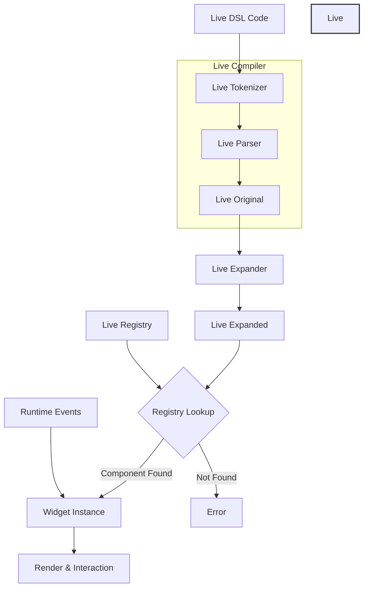

# Concepts


Live language is a domain-specific language (DSL) specifically designed for UI components and styling. Its basic structure is node-based, where each node can contain properties and child nodes.

`Live DSL` is compiled in real-time at runtime, supporting hot reloading and dynamic updates.

This design is suitable for the following scenarios:

1. UI systems requiring high dynamism
2. Development environments needing hot reload capabilities
3. Scenarios requiring runtime UI modifications

## Live DSL Lifecycle

The runtime compilation process of Live DSL roughly follows these steps:


### 1. Input Phase

The first step involves inputting Live Documents.

```rust
// Live DSL code
Button = {
    width: 100,
    height: 50,
    text: "Click me"
}
```

### 2. Live Compiler Phase

Live Tokenizer tokenization:

```rust
pub struct TokenWithSpan {
    pub token: LiveToken,
    pub span: TextSpan
}

// Convert code into token stream
[
    Token::Ident("Button"),
    Token::Punct("="),
    Token::Open(Brace),
    Token::Ident("width"),
    Token::Punct(":"),
    Token::Int(100),
    ...
]
```
`Live Parser` parsing:

```rust
pub struct LiveParser<'a> {
    pub token_index: usize,
    pub file_id: LiveFileId,
    pub tokens_with_span: Cloned<Iter<'a, TokenWithSpan>>,
    // ...
}

// Parse token stream into initial node structure
```
`Live Original` stores the raw node data parsed from source code, including:

- Complete source code mapping information
- Design-time and edit-time metadata
- Input for expansion process
- Support for error location and reporting

```rust
pub struct LiveOriginal {
    pub nodes: Vec<LiveNode>,           // Parsed node list
    pub edit_info: Vec<LiveNode>,       // Edit-related metadata nodes
    pub design_info: Vec<LiveDesignInfo>, // Design phase information
    pub tokens: Vec<TokenWithSpan>,     // Source code token stream
}
```
For example:

```rust
// Source code
Button = {
    width: 100,
    height: 50,
    label = {
        text: "Click me"
    }
}

// Parsed into LiveOriginal.nodes
[
    LiveNode { id: "Button", value: Object },
    LiveNode { id: "width", value: Int64(100) },
    LiveNode { id: "height", value: Int64(50) },
    LiveNode { id: "label", value: Object },
    LiveNode { id: "text", value: String("Click me") },
    LiveNode { value: Close },  // End of label
    LiveNode { value: Close }   // End of Button
]
```
`LiveOriginal` effectively serves as the AST (Abstract Syntax Tree) of Live DSL.

### 3.  Expansion Phase

The expansion phase extends component declarations in the DSL, handling property expansion, inheritance, establishing component relationships, and setting runtime context. This lays the foundation for subsequent rendering and interaction.

For example:

```rust
// Shorthand form
Button = <Button> {
    text: "Click me"
}

// After expansion
Button = <Button> {
    text: "Click me",
    draw_text: {
      color: #000
    },
    draw_bg: {...}
}
```
Live Expander:

```rust
pub struct LiveExpander<'a> {
    pub live_registry: &'a LiveRegistry,
    pub in_crate: LiveId,
    pub in_file_id: LiveFileId,
    pub errors: &'a mut Vec<LiveError>,
}

// Handles inheritance, references, and other relationships
```
Live Expanded:

```rust
pub struct LiveExpanded {
    pub nodes: Vec<LiveNode>,
}
```

### 4. Instantiation Phase

BTreeMap has several characteristics that make it particularly suitable:

- BTreeMap sorts by key by default, ensuring stability in component initialization, rendering, and destruction order; properly handling parent-child component dependencies; facilitating debugging and logging.
- BTreeMap's tree structure makes LiveNode data memory layout more compact. Related component data tends to be adjacent in memory, benefiting cache performance and potentially offering better performance than HashMap. BTreeMap typically has higher space utilization than HashMap.
- BTreeMap's tree structure is more stable, with component additions and removals not causing large-scale memory reallocations, leading to more predictable performance.

Therefore, it's well-suited for Widget Registry:

```rust
pub struct WidgetRegistry {
    pub map: BTreeMap<LiveType, (LiveComponentInfo, Box<dyn WidgetFactory>)>,
}
```
Widget Instance:

```rust
pub trait Widget: WidgetNode {
    fn handle_event(&mut self, cx: &mut Cx, event: &Event, scope: &mut Scope);
    fn draw(&mut self, cx: &mut Cx2d, scope: &mut Scope) -> DrawStep;
    // ...
}

pub trait WidgetNode: LiveApply {
    // Get design-time component instance
    fn widget_design(&mut self) -> Option<&mut dyn WidgetDesign> {
        return None;
    }
    // Find component by UID
    fn uid_to_widget(&self, _uid: WidgetUid) -> WidgetRef;
    // Find components
    fn find_widgets(&self, _path: &[LiveId], _cached: WidgetCache, _results: &mut WidgetSet);
    // Calculate layout information
    fn walk(&mut self, _cx: &mut Cx) -> Walk;
    // Get area
    fn area(&self) -> Area;
    // Redraw
    fn redraw(&mut self, _cx: &mut Cx);
}
```
Widget Node is the basic node in the UI component tree, providing fundamental layout, traversal, and drawing capabilities. It handles component area management and redrawing, supports component lookup and navigation, and serves as the basic requirement for the Widget trait.

A Widget instance can contain multiple Nodes, with each Node responsible for specific low-level functionality. Widgets achieve complete functionality through Node composition.

### 5. Runtime Interaction

```rust
impl Widget {
    fn handle_event(&mut self, cx: &mut Cx, event: &Event, scope: &mut Scope) {
        // Event handling
    }

    fn draw(&mut self, cx: &mut Cx2d, scope: &mut Scope) {
        // Rendering logic
    }
}
```
Widgets implement runtime interaction through three crucial mechanisms: `Event`, `Action`, and `Scope`. Their details will be covered in the events chapter.

## Live Node

Live Node can be understood as each AST node after parsing.

### 1. Basic Node Structure

In code implementation, nodes are represented by the `LiveNode` structure:

```rust
pub struct LiveNode {
    pub origin: LiveNodeOrigin,  // Node source information
    pub id: LiveId,             // Node identifier
    pub value: LiveValue,       // Node value
}
```

### 2. Node Types (LiveValue)

Nodes can contain multiple types of values:

```rust
pub enum LiveValue {
    // Basic value types
    None,
    Bool(bool),
    Int64(i64),
    Float64(f64),
    Color(u32),
    String(Arc<String>),

    // Composite types
    Object,            // Object node
    Array,            // Array node
    Clone{...},       // Clone/inheritance node
    Class{...},       // Class definition node

    // DSL special types
    DSL{...},         // DSL code block
    Import(...),      // Import declaration
}
```

### 3. Node Organization

- Basic nodes

```rust
Button = {  // This is a node
    width: 100,    // This is also a node
    height: 50,    // This is also a node
}
```
- Nested nodes

```rust
Window = {                  // Parent node
    header = {             // Child node
        title = {          // Grandchild node
            text: "Hello"  // Leaf node
        }
    }
}
```
- Array nodes

```rust
List = {
    items: [          // Array node
        {text: "1"},  // Child node 1
        {text: "2"},  // Child node 2
        {text: "3"}   // Child node 3
    ]
}
```
