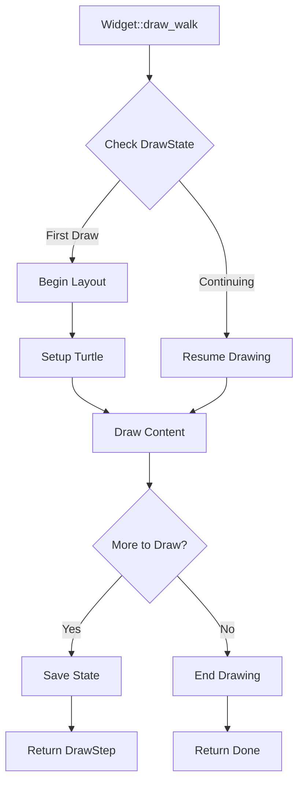
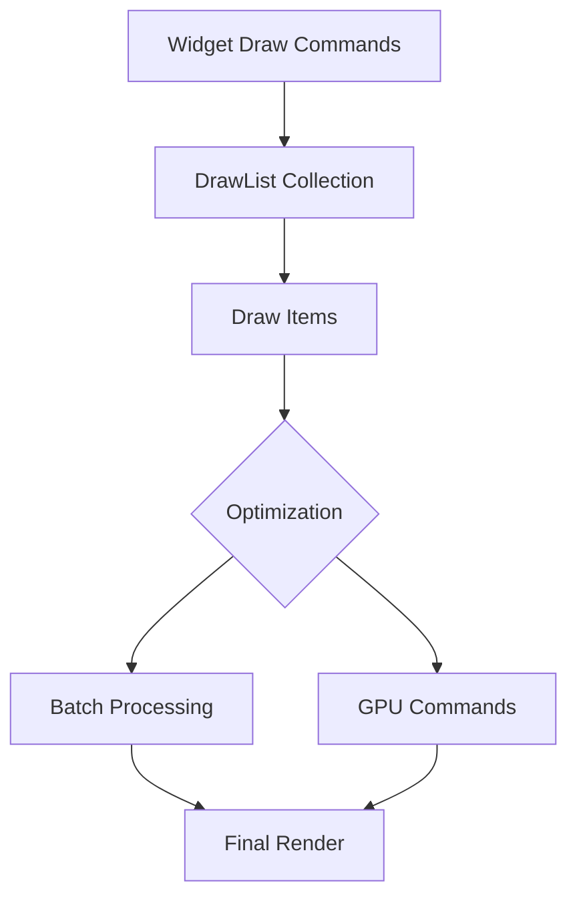
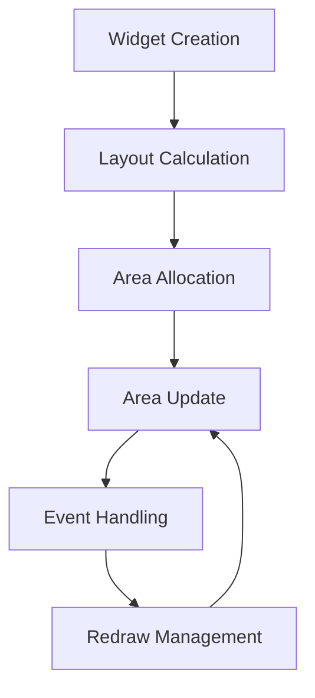

# Rendering Mechanism

## Drawing Process Control

### DrawStep State Machine

```rust

pub trait DrawStepApi {
    fn done() -> DrawStep {
        Result::Ok(())
    }
    fn make_step_here(arg: WidgetRef) -> DrawStep {
        Result::Err(arg)
    }
    fn make_step() -> DrawStep {
        Result::Err(WidgetRef::empty())
    }
    fn is_done(&self) -> bool;
    fn is_step(&self) -> bool;
    fn step(self) -> Option<WidgetRef>;
}

impl DrawStepApi for DrawStep {
    fn is_done(&self) -> bool {
        match *self {
            Result::Ok(_) => true,
            Result::Err(_) => false,
        }
    }
    fn is_step(&self) -> bool {
        match *self {
            Result::Ok(_) => false,
            Result::Err(_) => true,
        }
    }

    fn step(self) -> Option<WidgetRef> {
        match self {
            Result::Ok(_) => None,
            Result::Err(nd) => Some(nd),
        }
    }
}

pub type DrawStep = Result<(), WidgetRef>;
```
Advantages of designing a state machine based on `Result`:

#### 1. **Supports Incremental Rendering**

- `Result::Err(WidgetRef)` indicates rendering is incomplete, needs next step
- `Result::Ok(())` indicates rendering is complete
- This design allows rendering process to be divided into multiple executable steps

#### 2. **State Preservation**

- Using `Result` can maintain state between rendering steps
- `Err(WidgetRef)` carries information about which component needs rendering next

#### 3. **Control Flow Management**

- Elegantly handles rendering process using `?` operator
- Easy to implement rendering pause, continue, and termination
- Easy to optimize, supports complex interactions

#### 4. **Memory Efficiency**

- `Result` is a zero-cost abstraction
- State machine transitions produce no additional overhead

### Drawing Process



Let's explain the drawing process through a simple `Button` widget:

```rust
pub struct Button {
    // Drawing state machine
    #[rust] draw_state: DrawStateWrap<DrawState>,
    // Layout information
    #[layout] layout: Layout,
    // Positioning information
    #[walk] walk: Walk,
    // Background drawing
    #[live] draw_bg: DrawColor,
    // Text drawing
    #[live] draw_text: DrawText,
}

impl Widget for Button {
    fn draw_walk(&mut self, cx: &mut Cx2d, scope: &mut Scope, walk: Walk) -> DrawStep {
        // 1. Initialize drawing state
        if self.draw_state.begin(cx, DrawState::DrawBackground) {
            // Start layout calculation
            self.draw_bg.begin(cx, walk, self.layout);
            return DrawStep::make_step();
        }

        // 2. Draw background
        if let Some(DrawState::DrawBackground) = self.draw_state.get() {
            self.draw_bg.end(cx);
            // Switch to text drawing state
            self.draw_state.set(DrawState::DrawText);
            return DrawStep::make_step();
        }

        // 3. Draw text
        if let Some(DrawState::DrawText) = self.draw_state.get() {
            let text_walk = Walk::size(Size::Fill, Size::Fit);
            self.draw_text.draw_walk(cx, scope, text_walk)?;
            self.draw_state.end();
        }

        DrawStep::done()
    }
}

// Drawing state enumeration
#[derive(Clone)]
enum DrawState {
    DrawBackground,
    DrawText
}
```
Key points analysis:

1. **State Management**
    - DrawStateWrap manages drawing state
    - Each state corresponds to a drawing phase
    - Can interrupt and resume at any stage
2. **Layout System**

```rust
// Set layout
self.draw_bg.begin(cx, walk, self.layout);

// Turtle automatically handles:
// - Element position calculation
// - Margin/Padding handling
// - Child element layout

```

1. **Progressive Drawing**

```rust
// Return continue marker
return DrawStep::make_step();

// Return completion marker
return DrawStep::done();
```

1. **State Transitions**

```rust
// Switch to next state
self.draw_state.set(DrawState::DrawText);

// End drawing
self.draw_state.end();
```

### Drawing Model

Makepad employs a sophisticated but efficient deferred drawing system. 

The core feature of this system is that drawing commands are not executed immediately, but are collected into a draw list (DrawList) for batch processing.



DrawList is the core of Makepad's drawing system. Let's look at its structure:

```rust
// In platform/src/draw_list.rs
pub struct CxDrawList {
    pub debug_id: LiveId,
    pub codeflow_parent_id: Option<DrawListId>,
    pub redraw_id: u64,
    pub pass_id: Option<PassId>,
    pub draw_items: CxDrawItems,
    pub draw_list_uniforms: CxDrawListUniforms,
    pub rect_areas: Vec<CxRectArea>,
}

pub struct CxDrawItems {
    pub(crate) buffer: Vec<CxDrawItem>,
    used: usize
}

pub struct CxDrawItem {
    pub redraw_id: u64,
    pub kind: CxDrawKind,
    pub draw_item_id: usize,
    pub instances: Option<Vec<f32>>,
    pub os: CxOsDrawCall
}
```
When we call a `redraw` command, here's what actually happens:

```rust
impl DrawQuad {
    pub fn draw(&mut self, cx: &mut Cx2d) {
        // 1. Not immediate drawing, but collecting draw commands
        if let Some(mi) = &mut self.many_instances {
            // Batch processing mode: Add instance data to buffer
            // This allows multiple similar draw operations to be batch processed,
            // greatly reducing GPU calls
            mi.instances.extend_from_slice(self.draw_vars.as_slice());
        }
        else if self.draw_vars.can_instance() {
            // Single instance mode: Create new instance
            let new_area = cx.add_aligned_instance(&self.draw_vars);
            self.draw_vars.area = cx.update_area_refs(self.draw_vars.area, new_area);
        }
    }
}
```
Drawing command merging:

```rust
impl CxDrawList {
    pub fn find_appendable_drawcall(
        &mut self,
        sh: &CxDrawShader,
        draw_vars: &DrawVars
    ) -> Option<usize> {
        // Try to find mergeable draw calls
        if let Some((_,draw_call)) = self.draw_items.iter_mut()
            .find(|item| item.can_append(sh, draw_vars)) {
            return Some(draw_call);
        }
        None
    }
}
```
View optimization:

```rust
enum ViewOptimize {
    None,
    DrawList,    // Use independent draw list
    Texture     // Render to texture cache
}
```
For example, Makepad's built-in `View` Widget uses `ViewOptimize` optimization.

**1. DrawList mode** creates an independent draw list for the view that can be cached and reused.

Suitable scenarios:

- Interfaces with moderate frequency of changes
- Complex views that need to maintain interaction responsiveness
- Containers with many child elements

**2. Texture mode** renders the entire view to a texture, then uses this texture as a whole.

Suitable scenarios:

- Static or rarely changing content
- Views with complex visual effects but relatively stable content
- Interfaces requiring special visual effects (like blur, transforms, etc.)

In practice, view hierarchy can be reasonably divided.

```rust
// Recommended view hierarchy structure
RootView (No Optimization)
├── StaticBackground (Texture)
├── ContentArea (DrawList)
│   ├── StaticWidgets (Texture)
│   └── DynamicWidgets (DrawList)
└── OverlayLayer (No Optimization)
```

### Area Management

In Makepad, the core of area management is the `Area` type, which is used to track and manage the drawing area of widgets on screen. 

Each Widget has an associated Area, which is used not only for determining drawing position but also for event handling (Event) and hit detection.

```rust
// Core area type definition
#[derive(Clone, Copy, Debug)]
pub enum Area {
    Empty,
    Instance(InstanceArea), // Instance area (for rendering instances)
    Rect(RectArea) // Rectangle area (for basic shapes)
}

pub struct RectArea {
    pub draw_list_id: DrawListId,
    pub redraw_id: u64,
    pub rect_id: usize
}

pub struct InstanceArea {
    pub draw_list_id: DrawListId,
    pub draw_item_id: usize,
    pub instance_count: usize,
    pub instance_offset: usize,
    pub redraw_id: u64
}
```
The lifecycle of an `Area` can be visualized as follows:


Here's the core implementation of `Area` management:

- Area Creation and Allocation:

```rust
impl Widget {
    fn draw_walk(&mut self, cx: &mut Cx2d, scope: &mut Scope, walk: Walk) -> DrawStep {
        // Start with layout calculation
        if self.draw_state.begin(cx, DrawState::Begin) {
            // Begin layout calculation
            cx.begin_turtle(walk, self.layout);

            // Area allocation
            cx.walk_turtle_with_area(&mut self.area, walk);

            // Area update and reference management
            self.area = cx.update_area_refs(self.area, new_area);
        }
    }
}
```
- Area Update and Tracking:

```rust
impl Cx2d {
    pub fn update_area_refs(&mut self, old_area: Area, new_area: Area) -> Area {
        if old_area == Area::Empty {
            return new_area;
        }

        // Update IME area
        if self.ime_area == old_area {
            self.ime_area = new_area;
        }

        // Update finger event areas
        self.fingers.update_area(old_area, new_area);

        // Update drag-drop areas
        self.drag_drop.update_area(old_area, new_area);

        // Update keyboard focus areas
        self.keyboard.update_area(old_area, new_area);

        new_area
    }
}
```
- Area Clipping, which controls content visibility, maintains visual boundaries, and handles content overflow.
    - For Instance areas: Clipping information is stored in shader draw call uniforms
    - For Rectangle areas: Clipping information is stored directly in the RectArea structure:

```rust
pub struct CxRectArea {
    pub rect: Rect,                // The rectangle itself
    pub draw_clip: (DVec2, DVec2)  // Stores clipping range's min and max points
}
```

The core clipping functionality is implemented in the `clipped_rect()` method within the `Area` source code.

For Instance areas:

1. Clipping boundaries are stored in shader uniforms as four values (minX, minY, maxX, maxY)
2. During drawing, the shader applies these clipping boundaries to limit pixel drawing range
3. Clipping is implemented at the vertex shader stage by limiting vertex positions

For Rectangle areas:

1. Clipping boundaries are stored directly in the `RectArea` structure
2. Clipping is implemented through intersection of rectangles with their clipping boundaries
3. This generates a new rectangle representing the visible portion

#### Event Handling

Makepad's event system is divided into several levels:

```rust
// Top-level event enumeration
pub enum Event {
    FingerDown(FingerDownEvent),
    FingerUp(FingerUpEvent),
    FingerMove(FingerMoveEvent),
    KeyDown(KeyEvent),
    KeyUp(KeyEvent),
    // ...
}

// Event hit detection results
pub enum Hit {
    KeyFocus(KeyFocusEvent),
    FingerDown(FingerDownEvent),
    Nothing
}
```
Events are dispatched following this flow:
```rust
impl Widget for MyWidget {
    fn handle_event(&mut self, cx: &mut Cx, event: &Event, scope: &mut Scope) {
        // Check if event hits this widget's area
        match event.hits(cx, self.area()) {
            Hit::FingerDown(e) => {
                // Handle click event
                cx.widget_action(uid, &scope.path, MyAction::Clicked);
            }
            Hit::KeyDown(e) => {
                // Handle keyboard event
            }
            _ => ()
        }
    }
}
```
Here's an example of a simple `Button` event handling:
```rust
#[derive(Live)]
pub struct Button {
    #[rust] pub area: Area,
    #[live] pub text: String,
    #[animator] pub animator: Animator,
}

impl Widget for Button {
    fn handle_event(&mut self, cx: &mut Cx, event: &Event, scope: &mut Scope) {
        let uid = self.widget_uid();

        // Handle animation events
        if self.animator_handle_event(cx, event).must_redraw() {
            self.redraw(cx);
        }

        match event.hits(cx, self.area()) {
            Hit::FingerDown(_) => {
                // Trigger click animation
                self.animator_play(cx, id!(down.on));
                // Send click event action
                cx.widget_action(uid, &scope.path, ButtonAction::Clicked);
            }
            Hit::FingerUp(_) => {
                self.animator_play(cx, id!(down.off));
            }
            _ => ()
        }
    }
}
```

## Event System

The event system has a layered architecture:

- Low-level event system (Event) - Handles system and UI basic events
- Mid-level action system (Action) - Handles component communication and state updates
- High-level message system (Signal/Channel) - Handles cross-thread communication

### Makepad's Thread Model


Makepad 分为主 `UI 线程`和其他多个 `Worker 线程`。

1. **Single UI Thread**

- UI rendering and event handling occur on the main thread
- Main thread runs the event loop (event_loop)
- All UI updates must happen on the main thread

2. **Multiple Worker Threads**

- Background tasks are managed through thread pools
- Multiple thread pool implementations available for different needs
- Worker threads don't directly manipulate UI

3. **Inter-thread Communication Mechanisms**

- Action system for thread message passing
- Signal mechanism for thread synchronization
- Channel for data transfer

Main thread (UI thread) model:

```rust
// Main thread entry point defined in app_main macro
pub fn app_main() {
    // Create Cx
    let mut cx = Rc::new(RefCell::new(Cx::new(Box::new(move |cx, event| {
        // Main event handling loop
        if let Event::Startup = event {
            *app.borrow_mut() = Some($app::new_main(cx));
        }
        if let Event::LiveEdit = event {
            app.borrow_mut().update_main(cx);
        }
        app.borrow_mut().as_mut().unwrap().handle_event(cx, event);
    }))));

    // Register components, initialize etc.
    $app::register_main_module(&mut *cx.borrow_mut());
    live_design(&mut *cx.borrow_mut());
    cx.borrow_mut().init_cx_os();

    // Start event loop
    Cx::event_loop(cx);
}
```
Inter-thread communication mechanisms:

```rust
// Global Action send channel
static ACTION_SENDER_GLOBAL: Mutex<Option<Sender<ActionSendSync>>> = Mutex::new(None);

// UI signal mechanism
pub struct SignalToUI(Arc<AtomicBool>);

// Thread communication Receiver/Sender
pub struct ToUIReceiver<T> {
    sender: Sender<T>,
    pub receiver: Receiver<T>,
}

pub struct ToUISender<T> {
    sender: Sender<T>,
}
```
Thread pools included:

```rust
// Standard thread pool for simple task execution
pub struct RevThreadPool {
    tasks: Arc<Mutex<Vec<Box<dyn FnOnce() + Send + 'static>>>>,
}

// Tagged thread pool for tasks that need categorization and cancellation
pub struct TagThreadPool<T: Clone + Send + 'static + PartialEq> {
    tasks: Arc<Mutex<Vec<(T, Box<dyn FnOnce(T) + Send + 'static>)>>>,
}

// Message thread pool for continuous inter-thread communication
pub struct MessageThreadPool<T: Clone + Send + 'static> {
    sender: Sender<Box<dyn FnOnce(Option<T>) + Send + 'static>>,
    msg_senders: Vec<Sender<T>>,
}
```
Main communication flow:

```rust
// 1. Worker thread sends Action to main thread
Cx::post_action(action); // Send via global ACTION_SENDER

// 2. Main thread processes received Actions
impl Cx {
    pub fn handle_action_receiver(&mut self) {
        while let Ok(action) = self.action_receiver.try_recv() {
            self.new_actions.push(action);
        }
        self.handle_actions();
    }
}

// 3. UI state update notification
SignalToUI::set_ui_signal(); // Notify UI that update is needed
```

### Event System Overview

Makepad provides an `Event` mechanism for bottom-up propagation (distributed from system/framework to components) of system-level events (like mouse, keyboard, touch, etc.).

Events are synchronously processed global events.

```rust
pub enum Event {
    // Application lifecycle events
    Startup,
    Shutdown,
    Foreground,
    Background,
    Resume,
    Pause,

    // UI interaction events
    Draw(DrawEvent),
    MouseDown(MouseDownEvent),
    MouseMove(MouseMoveEvent),
    KeyDown(KeyEvent),
    TextInput(TextInputEvent),

    // Custom events
    Signal,  // For inter-thread communication
    Actions(ActionsBuf), // Container for custom actions
    Timer(TimerEvent),  // Timer events
}
```
Additionally, Makepad provides an `Action` mechanism for top-down propagation (sent from components to parent components/listeners) of internal business actions.

These Actions can be either synchronous or asynchronous.

**Summary of Event and Action differences**:

- Events are system-level input events, propagating bottom-up to transmit low-level events.
- Actions are component-level business actions, propagating top-down to transmit business actions.

```rust
// Action trait definition
pub trait ActionTrait: 'static {
    fn debug_fmt(&self, f: &mut fmt::Formatter<'_>) -> fmt::Result;
    fn ref_cast_type_id(&self) -> TypeId;
}

// Concrete Action example, defining Button's business code
#[derive(Clone, Debug)]
pub enum ButtonAction {
    Clicked,
    Pressed,
    Released
}
```
Makepad provides a unified Action sending and handling mechanism through `widget_action`, and Actions can carry data and state.

```rust
// Action wrapper structure
pub struct WidgetAction {
    pub action: Box<dyn WidgetActionTrait>,
    pub data: Option<Arc<dyn ActionTrait>>, // Associated data
    pub widgets: SmallVec<[WidgetRef;4]>, // Widget references sending the action
    pub widget_uid: WidgetUid,  // Widget unique ID
    pub path: HeapLiveIdPath,   // Widget path
    pub group: Option<WidgetActionGroup> // Group information
}

// Action group information
pub struct WidgetActionGroup {
    pub group_uid: WidgetUid,
    pub item_uid: WidgetUid,
}
```
Components send Actions through `widget_action`:

```rust
impl WidgetActionCxExt for Cx {
    // Send a simple action
    fn widget_action(
        &mut self,
        widget_uid: WidgetUid,  // Widget ID
        path: &HeapLiveIdPath,  // Widget path
        t: impl WidgetActionTrait // Action content
    ) {
        self.action(WidgetAction {
            widget_uid,
            data: None,
            path: path.clone(),
            widgets: Default::default(),
            action: Box::new(t),
            group: None,
        })
    }

    // Send action with data
    fn widget_action_with_data(
        &mut self,
        action_data: &WidgetActionData,
        widget_uid: WidgetUid,
        path: &HeapLiveIdPath,
        t: impl WidgetActionTrait,
    ) {
        self.action(WidgetAction {
            widget_uid,
            data: action_data.clone_data(),
            path: path.clone(),
            widgets: Default::default(),
            action: Box::new(t),
            group: None,
        })
    }
}

#[derive(Default)]
pub struct WidgetActionData{
    data: Option<Arc<dyn ActionTrait>>
}
```
Actions are collected in the `context`'s `action buffer`:

```rust
impl Cx {
    pub fn action(&mut self, action: impl ActionTrait) {
        self.new_actions.push(Box::new(action));
    }
}
```
Receivers get all Actions:

```rust
// Capture all actions produced during an event handling process
let actions = cx.capture_actions(|cx| {
    self.button.handle_event(cx, event, scope);
});
```
Then search for specific Actions:

```rust
impl WidgetActionsApi for Actions {
    // Find action by component path
    fn widget_action(&self, path: &[LiveId]) -> Option<&WidgetAction> {
        for action in self {
            if let Some(action) = action.downcast_ref::<WidgetAction>() {
                let mut ap = action.path.data.iter().rev();
                if path.iter().rev().all(|p| ap.find(|&ap| p == ap).is_some()) {
                    return Some(action)
                }
            }
        }
        None
    }

    // Find action by component ID
    fn find_widget_action(&self, widget_uid: WidgetUid) -> Option<&WidgetAction> {
        for action in self {
            if let Some(action) = action.downcast_ref::<WidgetAction>() {
                if action.widget_uid == widget_uid {
                    return Some(action);
                }
            }
        }
        None
    }
}
```
Action type conversion and handling:

```rust
// Example: Handle button click event
impl ButtonRef {
    pub fn clicked(&self, actions: &Actions) -> bool {
        if let ButtonAction::Clicked = actions.find_widget_action(self.widget_uid()).cast() {
            return true
        }
        false
    }
}

// Usage example
let actions = cx.capture_actions(|cx| {
    self.button.handle_event(cx, event, scope);
});

if self.button.clicked(&actions) {
    // Handle click event
}
```
This mechanism allows Makepad's components to flexibly pass states and communicate events while maintaining good decoupling and maintainability.

### Event Handling Process

Since the `Widget` trait's `handle_event` mainly focuses on two aspects:

```rust
impl Widget for MyWidget {
    fn handle_event(&mut self, cx: &mut Cx, event: &Event, scope: &mut Scope) {
        // 1. Handle hit test events within area (clicks, drags, etc.)
        match event.hits(cx, self.area()) {
            Hit::FingerDown(e) => { ... }
            Hit::KeyDown(e) => { ... }
        }

        // 2. Handle animation-related events
        if self.animator_handle_event(cx, event).must_redraw() {
            self.draw_key.area().redraw(cx)
        }
    }
}
```

However, there are actually many events that are unrelated to Area, such as:

- Lifecycle events (startup, shutdown)
- Global events (foreground, background switches)
- Action handling
- Drawing events
- Animation frame updates

If all these events were handled in each Widget, the match event branches would be very redundant.

```rust
// Without using MatchEvent
impl Widget for MyWidget {
    fn handle_event(&mut self, cx: &mut Cx, event: &Event, scope: &mut Scope) {
        match event {
            Event::Startup => { ... }
            Event::Draw(e) => { ... }
            Event::NextFrame(e) => { ... }
            Event::Actions(e) => { ... }
            // Still need to handle hit testing
            _ => match event.hits(cx, self.area()) {
                Hit::FingerDown(e) => { ... }
            }
        }
    }
}
```
Therefore, Makepad provides the `MatchEvent` trait, which provides a series of default implementations to make the code clearer:
```rust
#[derive(Default)]
struct MyComplexWidget {
    area: Area,
    value: f64,
    animator: Animator
}

// Widget trait handles core interaction logic
impl Widget for MyComplexWidget {
    fn handle_event(&mut self, cx: &mut Cx, event: &Event, scope: &mut Scope) {
        let uid = self.widget_uid();

        // 1. Animation handling
        if self.animator_handle_event(cx, event).must_redraw() {
            self.redraw(cx);
        }

        // 2. Interaction event handling
        match event.hits(cx, self.area) {
            Hit::FingerDown(_) => {
                self.animator_play(cx, id!(down.on));
                cx.widget_action(uid, &scope.path, MyAction::Clicked);
            }
            Hit::KeyDown(ke) => {
                // Keyboard event handling
            }
            _ => ()
        }

        // 3. Use MatchEvent to handle other events
        self.match_event(cx, event);
    }
}

// MatchEvent trait handles business logic
impl MatchEvent for MyComplexWidget {
    // Lifecycle events
    fn handle_startup(&mut self, cx: &mut Cx) {
        // Initialize configuration
    }

    // State updates
    fn handle_actions(&mut self, cx: &mut Cx, actions: &Actions) {
        for action in actions {
            if let MyAction::ValueChanged(new_value) = action.cast() {
                self.value = new_value;
                self.redraw(cx);
            }
        }
    }

    // Drawing related
    fn handle_draw_2d(&mut self, cx: &mut Cx2d) {
        // Custom drawing logic
    }

    // Animation frames
    fn handle_next_frame(&mut self, cx: &mut Cx, e: &NextFrameEvent) {
        // Animation updates
    }
}
```
This way components can focus on implementing their own event handling logic without writing lots of matching code.

Event handling priority in Makepad is as follows:

1. Animation events (Animator)
2. Direct interaction events (Hit)
3. General system events (MatchEvent)
4. Business Actions

### Signal Mechanism

```rust
// UI signal mechanism
pub struct SignalToUI(Arc<AtomicBool>);

impl SignalToUI {
    // Set UI signal
    pub fn set_ui_signal() {
        UI_SIGNAL.store(true, Ordering::SeqCst)
    }

    // Check and clear signal
    pub fn check_and_clear(&self) -> bool {
        self.0.swap(false, Ordering::SeqCst)
    }
}

// UI message channel
pub struct ToUIReceiver<T> {
    sender: Sender<T>,
    pub receiver: Receiver<T>,
}

pub struct ToUISender<T> {
    sender: Sender<T>,
}
```
