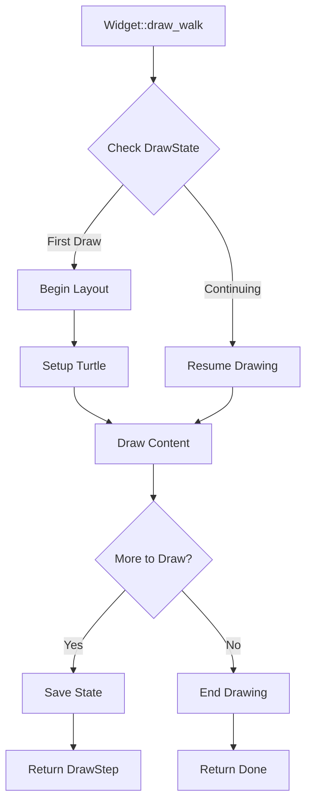
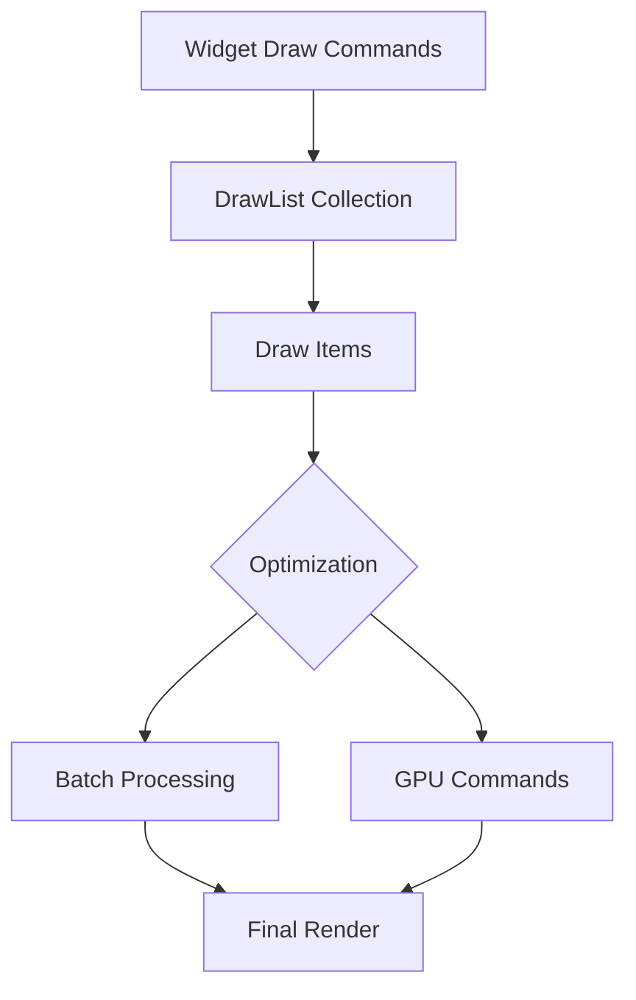
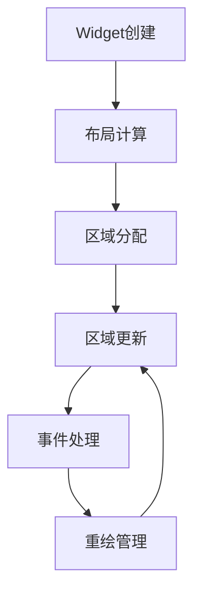

# Widget 渲染机制

## 绘制流程控制

### DrawStep 状态机

```rust

pub trait DrawStepApi {
    fn done() -> DrawStep {
        Result::Ok(())
    }
    fn make_step_here(arg: WidgetRef) -> DrawStep {
        Result::Err(arg)
    }
    fn make_step() -> DrawStep {
        Result::Err(WidgetRef::empty())
    }
    fn is_done(&self) -> bool;
    fn is_step(&self) -> bool;
    fn step(self) -> Option<WidgetRef>;
}

impl DrawStepApi for DrawStep {
    fn is_done(&self) -> bool {
        match *self {
            Result::Ok(_) => true,
            Result::Err(_) => false,
        }
    }
    fn is_step(&self) -> bool {
        match *self {
            Result::Ok(_) => false,
            Result::Err(_) => true,
        }
    }

    fn step(self) -> Option<WidgetRef> {
        match self {
            Result::Ok(_) => None,
            Result::Err(nd) => Some(nd),
        }
    }
}

pub type DrawStep = Result<(), WidgetRef>;
```
基于 `Result` 设计状态机的优势：

#### 1. **支持增量渲染**

- `Result::Err(WidgetRef)` 表示渲染未完成,需要继续下一步
- `Result::Ok(())` 表示渲染完成
- 这种设计让渲染过程可以被分成多个步骤执行

#### 2. **状态保持**

- 使用 `Result` 可以在每个渲染步骤之间保持状态
- `Err(WidgetRef)` 携带了下一步需要渲染的组件信息

#### 3. **控制流管理**

- 通过 `?` 运算符优雅地处理渲染流程
- 容易实现渲染的暂停、继续和终止
- 易于优化，支持复杂交互

#### 4. **内存效率**

- `Result` 是零成本抽象
- 状态机切换不会产生额外开销

### 绘制流程



下面通过一个简单 Button widget 来说明绘制流程：

```rust
pub struct Button {
    // 绘制状态机
    #[rust] draw_state: DrawStateWrap<DrawState>,
    // 布局信息
    #[layout] layout: Layout,
    // 定位信息
    #[walk] walk: Walk,
    // 背景绘制
    #[live] draw_bg: DrawColor,
    // 文本绘制
    #[live] draw_text: DrawText,
}

impl Widget for Button {
    fn draw_walk(&mut self, cx: &mut Cx2d, scope: &mut Scope, walk: Walk) -> DrawStep {
        // 1. 初始化绘制状态
        if self.draw_state.begin(cx, DrawState::DrawBackground) {
            // 开始布局计算
            self.draw_bg.begin(cx, walk, self.layout);
            return DrawStep::make_step();
        }

        // 2. 绘制背景
        if let Some(DrawState::DrawBackground) = self.draw_state.get() {
            self.draw_bg.end(cx);
            // 切换到文本绘制状态
            self.draw_state.set(DrawState::DrawText);
            return DrawStep::make_step();
        }

        // 3. 绘制文本
        if let Some(DrawState::DrawText) = self.draw_state.get() {
            let text_walk = Walk::size(Size::Fill, Size::Fit);
            self.draw_text.draw_walk(cx, scope, text_walk)?;
            self.draw_state.end();
        }

        DrawStep::done()
    }
}

// 绘制状态枚举
#[derive(Clone)]
enum DrawState {
    DrawBackground,
    DrawText
}
```
关键点解析:

1. **状态管理**

- DrawStateWrap 管理绘制状态
- 每个状态对应一个绘制阶段
- 可以在任何阶段中断和恢复

2. **布局系统**

```rust
// 设置布局
self.draw_bg.begin(cx, walk, self.layout);

// Turtle 会自动处理:
// - 元素位置计算
// - Margin/Padding 处理
// - 子元素布局
```
3. **渐进式绘制**

```rust
// 返回继续标记
return DrawStep::make_step();

// 返回完成标记
return DrawStep::done();
```

4. **状态转换**

```rust
// 切换到下一个状态
self.draw_state.set(DrawState::DrawText);

// 结束绘制
self.draw_state.end();
```

### 绘制模型

Makepad 采用了一个复杂但高效的延迟绘制系统。

这个系统的核心特点是:绘制命令不会立即执行，而是被收集到绘制列表(DrawList)中，最后统一处理。


DrawList 是 Makepad 绘制系统的核心。让我们看看它的结构：

```rust
// 在 platform/src/draw_list.rs 中
pub struct CxDrawList {
    pub debug_id: LiveId,
    pub codeflow_parent_id: Option<DrawListId>,
    pub redraw_id: u64,
    pub pass_id: Option<PassId>,
    pub draw_items: CxDrawItems,
    pub draw_list_uniforms: CxDrawListUniforms,
    pub rect_areas: Vec<CxRectArea>,
}

pub struct CxDrawItems {
    pub(crate) buffer: Vec<CxDrawItem>,
    used: usize
}

pub struct CxDrawItem {
    pub redraw_id: u64,
    pub kind: CxDrawKind,
    pub draw_item_id: usize,
    pub instances: Option<Vec<f32>>,
    pub os: CxOsDrawCall
}
```
当我们调用 redraw 命令时，实际发生的是：

```rust
impl DrawQuad {
    pub fn draw(&mut self, cx: &mut Cx2d) {
        // 1. 不是立即绘制，而是收集绘制命令
        if let Some(mi) = &mut self.many_instances {
            // 批处理模式：将实例数据添加到缓冲区
            // 这允许多个相似的绘制操作被批量处理，大大减少 GPU 调用次数
            mi.instances.extend_from_slice(self.draw_vars.as_slice());
        }
        else if self.draw_vars.can_instance() {
            // 单实例模式：创建新的实例
            let new_area = cx.add_aligned_instance(&self.draw_vars);
            self.draw_vars.area = cx.update_area_refs(self.draw_vars.area, new_area);
        }
    }
}
```
绘制命令合并：

```rust
impl CxDrawList {
    pub fn find_appendable_drawcall(
        &mut self,
        sh: &CxDrawShader,
        draw_vars: &DrawVars
    ) -> Option<usize> {
        // 尝试找到可以合并的绘制调用
        if let Some((_,draw_call)) = self.draw_items.iter_mut()
            .find(|item| item.can_append(sh, draw_vars)) {
            return Some(draw_call);
        }
        None
    }
}
```
视图优化：

```rust
enum ViewOptimize {
    None,
    DrawList,    // 使用独立绘制列表
    Texture     // 渲染到纹理缓存
}
```
比如 Makepad 内置的 View Widget ，就用了 ViewOptimize 优化。

**1.DrawList 模式**会为视图创建一个独立的绘制列表，这个列表可以被缓存和重用。

适用场景：

- 内容变化频率适中的界面
- 需要保持交互响应性的复杂视图
- 包含大量子元素的容器

**2.Texture 模式**会将整个视图渲染到一个纹理中，然后将这个纹理作为一个整体来使用。

适用场景：

- 静态或很少变化的内容
- 视觉效果复杂但内容相对稳定的视图
- 需要特殊视觉效果的界面（如模糊、变换等）

在实践中，可以合理划分视图层级。

```rust
// 推荐的视图层级结构
RootView (No Optimization)
├── StaticBackground (Texture)
├── ContentArea (DrawList)
│   ├── StaticWidgets (Texture)
│   └── DynamicWidgets (DrawList)
└── OverlayLayer (No Optimization)
```

### 绘制区域（Area）管理

在 Makepad 中，区域管理的核心是 `Area` 类型，它用于跟踪和管理 widget 在屏幕上的绘制区域。

每个 Widget 都有一个关联的 Area，这个 Area 不仅用于确定绘制位置，还用于事件处理（Event）和命中（Hit）检测。

```rust
// 核心区域类型定义
#[derive(Clone, Copy, Debug)]
pub enum Area {
    Empty,
    Instance(InstanceArea), // 实例区域(用于渲染实例)
    Rect(RectArea) // 矩形区域(用于基础图形)
}

pub struct RectArea {
    pub draw_list_id: DrawListId,
    pub redraw_id: u64,
    pub rect_id: usize
}

pub struct InstanceArea {
    pub draw_list_id: DrawListId,
    pub draw_item_id: usize,
    pub instance_count: usize,
    pub instance_offset: usize,
    pub redraw_id: u64
}
```
`Area` 的生命周期如下图：


`Area` 管理的核心实现如下：

- 区域创建和分配

```rust
impl Widget {
    fn draw_walk(&mut self, cx: &mut Cx2d, scope: &mut Scope, walk: Walk) -> DrawStep {
        // 从布局计算开始
        if self.draw_state.begin(cx, DrawState::Begin) {
            // 开始布局计算
            cx.begin_turtle(walk, self.layout);

            // 区域分配
            cx.walk_turtle_with_area(&mut self.area, walk);

            // 区域更新和引用管理
            self.area = cx.update_area_refs(self.area, new_area);
        }
    }
}
```
- 区域更新和追踪

```rust
impl Cx2d {
    pub fn update_area_refs(&mut self, old_area: Area, new_area: Area) -> Area {
        if old_area == Area::Empty {
            return new_area;
        }

        // 更新IME区域
        if self.ime_area == old_area {
            self.ime_area = new_area;
        }

        // 更新手指事件区域
        self.fingers.update_area(old_area, new_area);

        // 更新拖放区域
        self.drag_drop.update_area(old_area, new_area);

        // 更新键盘焦点区域
        self.keyboard.update_area(old_area, new_area);

        new_area
    }
}
```
- 区域裁剪，用于控制了内容的可见范围，维护视觉边界，处理内容溢出。
    - 对于实例区域(Instance)：裁剪信息存储在着色器的绘制调用统一变量中
    - 对于矩形区域(Rect)：裁剪信息直接存储在 RectArea 结构体中：

```rust
pub struct CxRectArea {
    pub rect: Rect,                // 矩形本身
    pub draw_clip: (DVec2, DVec2)  // 存储裁剪范围的最小点和最大点
}
```

裁剪实现细节核心的裁剪功能在 `Area` 源码中的 `clipped_rect()` 方法中实现。

对于实例区域(Instance)：

1. 裁剪边界以四个值(minX, minY, maxX, maxY)的形式存储在着色器统一变量中
2. 在绘制时，着色器会应用这些裁剪边界来限制像素的绘制范围
3. 裁剪在顶点着色器阶段通过限制顶点位置来实现

对于矩形区域(Rect)：

1. 裁剪边界直接存储在 `RectArea` 结构中
2. 裁剪通过矩形与其裁剪边界的求交来实现
3. 这会生成一个表示可见部分的新矩形

#### 事件处理

Makepad的事件系统分为几个层级:

```rust
// 顶层事件枚举
pub enum Event {
    FingerDown(FingerDownEvent),
    FingerUp(FingerUpEvent),
    FingerMove(FingerMoveEvent),
    KeyDown(KeyEvent),
    KeyUp(KeyEvent),
    // ...
}

// 事件命中检测结果
pub enum Hit {
    KeyFocus(KeyFocusEvent),
    FingerDown(FingerDownEvent),
    Nothing
}
```
事件的分发遵循以下流程:

```rust
impl Widget for MyWidget {
    fn handle_event(&mut self, cx: &mut Cx, event: &Event, scope: &mut Scope) {
        // 检查事件是否命中当前widget的area
        match event.hits(cx, self.area()) {
            Hit::FingerDown(e) => {
                // 处理点击事件
                cx.widget_action(uid, &scope.path, MyAction::Clicked);
            }
            Hit::KeyDown(e) => {
                // 处理键盘事件
            }
            _ => ()
        }
    }
}
```
下面是一个简单的 `Button` 事件处理的示例：

```rust
#[derive(Live)]
pub struct Button {
    #[rust] pub area: Area,
    #[live] pub text: String,
    #[animator] pub animator: Animator,
}

impl Widget for Button {
    fn handle_event(&mut self, cx: &mut Cx, event: &Event, scope: &mut Scope) {
        let uid = self.widget_uid();

        // 处理动画事件
        if self.animator_handle_event(cx, event).must_redraw() {
            self.redraw(cx);
        }

        match event.hits(cx, self.area()) {
            Hit::FingerDown(_) => {
                // 触发点击动画
                self.animator_play(cx, id!(down.on));
                // 发送点击事件action
                cx.widget_action(uid, &scope.path, ButtonAction::Clicked);
            }
            Hit::FingerUp(_) => {
                self.animator_play(cx, id!(down.off));
            }
            _ => ()
        }
    }
}
```

## 事件系统

事件系统分层架构:

- 底层事件系统(Event) - 处理系统和UI基础事件
- 中层动作系统(Action) - 处理组件间通信和状态更新
- 上层消息系统(Signal/Channel) - 处理跨线程通信

### Makepad 的线程模型


Makepad 分为主 `UI 线程`和其他多个 `Worker 线程`。

1. **单一UI渲染线程**：

- UI 渲染和事件处理在主线程进行
- 主线程运行事件循环(event_loop)
- 所有 UI 更新必须发生在主线程

2. **多个 Worker 线程**：

- 通过线程池管理后台任务
- 提供多种线程池实现以满足不同需求
- 工作线程不直接操作 UI

3. **线程间通信**：

- Action 系统用于线程间消息传递
- Signal 机制用于线程同步
- Channel 用于数据传输

主线程(UI线程)模型：

```rust
// app_main 宏中定义了主线程入口
pub fn app_main() {
    // 创建 Cx
    let mut cx = Rc::new(RefCell::new(Cx::new(Box::new(move |cx, event| {
        // 主要事件处理循环
        if let Event::Startup = event {
            *app.borrow_mut() = Some($app::new_main(cx));
        }
        if let Event::LiveEdit = event {
            app.borrow_mut().update_main(cx);
        }
        app.borrow_mut().as_mut().unwrap().handle_event(cx, event);
    }))));

    // 注册组件、初始化等
    $app::register_main_module(&mut *cx.borrow_mut());
    live_design(&mut *cx.borrow_mut());
    cx.borrow_mut().init_cx_os();

    // 启动事件循环
    Cx::event_loop(cx);
}
```
线程间通信机制：

```rust
// 全局 Action 发送通道
static ACTION_SENDER_GLOBAL: Mutex<Option<Sender<ActionSendSync>>> = Mutex::new(None);

// UI 信号机制
pub struct SignalToUI(Arc<AtomicBool>);

// 线程通信 Receiver/Sender
pub struct ToUIReceiver<T> {
    sender: Sender<T>,
    pub receiver: Receiver<T>,
}

pub struct ToUISender<T> {
    sender: Sender<T>,
}
```
包含了线程池：

```rust
// 标准线程池，用于简单的任务执行
pub struct RevThreadPool {
    tasks: Arc<Mutex<Vec<Box<dyn FnOnce() + Send + 'static>>>>,
}

// 带标签的线程池，用于需要分类和取消的任务
pub struct TagThreadPool<T: Clone + Send + 'static + PartialEq> {
    tasks: Arc<Mutex<Vec<(T, Box<dyn FnOnce(T) + Send + 'static>)>>>,
}

// 消息线程池，用于线程间持续通信
pub struct MessageThreadPool<T: Clone + Send + 'static> {
    sender: Sender<Box<dyn FnOnce(Option<T>) + Send + 'static>>,
    msg_senders: Vec<Sender<T>>,
}
```
主要通信流:

```rust
// 1. 工作线程发送 Action 到主线程
Cx::post_action(action); // 通过全局 ACTION_SENDER 发送

// 2. 主线程处理接收到的 Action
impl Cx {
    pub fn handle_action_receiver(&mut self) {
        while let Ok(action) = self.action_receiver.try_recv() {
            self.new_actions.push(action);
        }
        self.handle_actions();
    }
}

// 3. UI 状态更新通知
SignalToUI::set_ui_signal(); // 通知 UI 需要更新
```

### 事件系统概览

Makepad 提供 Event 机制，用于自底向上传播(由系统/框架分发给组件)来自系统底层的事件(如鼠标、键盘、触摸等)。

Event 是同步处理的全局性事件。

```rust
pub enum Event {
    // 应用生命周期事件
    Startup,
    Shutdown,
    Foreground,
    Background,
    Resume,
    Pause,

    // UI交互事件
    Draw(DrawEvent),
    MouseDown(MouseDownEvent),
    MouseMove(MouseMoveEvent),
    KeyDown(KeyEvent),
    TextInput(TextInputEvent),

    // 自定义事件
    Signal,  // 用于线程间通讯
    Actions(ActionsBuf), // 自定义动作的容器
    Timer(TimerEvent),  // 定时器事件
}
```
此外，Makepad 也提供 `Action` 机制，用于自顶向下传播(由组件发送给父组件/监听者)的内部业务动作。

这些 `Action` 是可以同步也可以异步。

**总结 Event 和 Action 区别**：

- Event 是系统级别的输入事件，自底而上传播底层事件。
- Action 是组件级别的业务动作，自顶而下传播业务动作。

```rust
// Action 特征定义
pub trait ActionTrait: 'static {
    fn debug_fmt(&self, f: &mut fmt::Formatter<'_>) -> fmt::Result;
    fn ref_cast_type_id(&self) -> TypeId;
}

// 具体 Action 示例，定义 Button 的业务代码
#[derive(Clone, Debug)]
pub enum ButtonAction {
    Clicked,
    Pressed,
    Released
}
```
Makepad 通过 `widget_action` 提供了一个统一的 Action 发送和处理机制，并且 Action 可以携带数据和状态。

```rust
// Action的包装结构
pub struct WidgetAction {
    pub action: Box<dyn WidgetActionTrait>,
    pub data: Option<Arc<dyn ActionTrait>>, // 关联数据
    pub widgets: SmallVec<[WidgetRef;4]>, // 发送action的组件引用
    pub widget_uid: WidgetUid,  // 组件唯一ID
    pub path: HeapLiveIdPath,   // 组件路径
    pub group: Option<WidgetActionGroup> // 分组信息
}

// Action分组信息
pub struct WidgetActionGroup {
    pub group_uid: WidgetUid,
    pub item_uid: WidgetUid,
}
```
组件通过 `widget_action` 发送 Action：

```rust
impl WidgetActionCxExt for Cx {
    // 发送一个简单的action
    fn widget_action(
        &mut self,
        widget_uid: WidgetUid,  // 组件ID
        path: &HeapLiveIdPath,  // 组件路径
        t: impl WidgetActionTrait // Action内容
    ) {
        self.action(WidgetAction {
            widget_uid,
            data: None,
            path: path.clone(),
            widgets: Default::default(),
            action: Box::new(t),
            group: None,
        })
    }

    // 发送带数据的action
    fn widget_action_with_data(
        &mut self,
        action_data: &WidgetActionData,
        widget_uid: WidgetUid,
        path: &HeapLiveIdPath,
        t: impl WidgetActionTrait,
    ) {
        self.action(WidgetAction {
            widget_uid,
            data: action_data.clone_data(),
            path: path.clone(),
            widgets: Default::default(),
            action: Box::new(t),
            group: None,
        })
    }
}

#[derive(Default)]
pub struct WidgetActionData{
    data: Option<Arc<dyn ActionTrait>>
}
```
Action 被收集到 `context` 的 `action buffer` :

```rust
impl Cx {
    pub fn action(&mut self, action: impl ActionTrait) {
        self.new_actions.push(Box::new(action));
    }
}
```
接收方获取所有 Actions:

```rust
// 捕获某个事件处理过程中产生的所有actions
let actions = cx.capture_actions(|cx| {
    self.button.handle_event(cx, event, scope);
});
```
再查找特定的 Action :

```rust
impl WidgetActionsApi for Actions {
    // 通过组件路径查找action
    fn widget_action(&self, path: &[LiveId]) -> Option<&WidgetAction> {
        for action in self {
            if let Some(action) = action.downcast_ref::<WidgetAction>() {
                let mut ap = action.path.data.iter().rev();
                if path.iter().rev().all(|p| ap.find(|&ap| p == ap).is_some()) {
                    return Some(action)
                }
            }
        }
        None
    }

    // 通过组件ID查找action
    fn find_widget_action(&self, widget_uid: WidgetUid) -> Option<&WidgetAction> {
        for action in self {
            if let Some(action) = action.downcast_ref::<WidgetAction>() {
                if action.widget_uid == widget_uid {
                    return Some(action);
                }
            }
        }
        None
    }
}
```
Action 的类型转换与处理:

```rust
// 示例: 处理按钮点击事件
impl ButtonRef {
    pub fn clicked(&self, actions: &Actions) -> bool {
        if let ButtonAction::Clicked = actions.find_widget_action(self.widget_uid()).cast() {
            return true
        }
        false
    }
}

// 使用示例
let actions = cx.capture_actions(|cx| {
    self.button.handle_event(cx, event, scope);
});

if self.button.clicked(&actions) {
    // 处理点击事件
}
```
这套机制让 Makepad 的组件能够灵活地进行状态传递和事件通信,同时保持了良好的解耦性和可维护性。

### 事件处理流程

因为 `Widget trait` 中的 `handle_event` 主要关注两个方面:

```rust
impl Widget for MyWidget {
    fn handle_event(&mut self, cx: &mut Cx, event: &Event, scope: &mut Scope) {
        // 1. 处理区域内的命中测试事件(点击、拖拽等)
        match event.hits(cx, self.area()) {
            Hit::FingerDown(e) => { ... }
            Hit::KeyDown(e) => { ... }
        }

        // 2. 处理动画相关事件
        if self.animator_handle_event(cx, event).must_redraw() {
            self.draw_key.area().redraw(cx)
        }
    }
}
```

但实际有很多事件是与 Area 无关的，比如:

- 生命周期事件(启动、关闭)
- 全局事件(前台、后台切换)
- Action 处理
- 绘制事件
- 动画帧更新

如果这些事件都在每个 Widget 中处理的话， match event 分支就会很冗余。

```rust
// 不用 MatchEvent
impl Widget for MyWidget {
    fn handle_event(&mut self, cx: &mut Cx, event: &Event, scope: &mut Scope) {
        match event {
            Event::Startup => { ... }
            Event::Draw(e) => { ... }
            Event::NextFrame(e) => { ... }
            Event::Actions(e) => { ... }
            // 还要处理命中测试
            _ => match event.hits(cx, self.area()) {
                Hit::FingerDown(e) => { ... }
            }
        }
    }
}
```
所以，Makepad 提供 `MatchEvent` trait，来提供一系列默认实现的方法，让代码更清晰:

```rust
#[derive(Default)]
struct MyComplexWidget {
    area: Area,
    value: f64,
    animator: Animator
}

// Widget trait 处理核心交互逻辑
impl Widget for MyComplexWidget {
    fn handle_event(&mut self, cx: &mut Cx, event: &Event, scope: &mut Scope) {
        let uid = self.widget_uid();

        // 1. 动画处理
        if self.animator_handle_event(cx, event).must_redraw() {
            self.redraw(cx);
        }

        // 2. 交互事件处理
        match event.hits(cx, self.area) {
            Hit::FingerDown(_) => {
                self.animator_play(cx, id!(down.on));
                cx.widget_action(uid, &scope.path, MyAction::Clicked);
            }
            Hit::KeyDown(ke) => {
                // 键盘事件处理
            }
            _ => ()
        }

        // 3. 使用 MatchEvent 处理其他事件
        self.match_event(cx, event);
    }
}

// MatchEvent trait 处理业务逻辑
impl MatchEvent for MyComplexWidget {
    // 生命周期事件
    fn handle_startup(&mut self, cx: &mut Cx) {
        // 初始化配置
    }

    // 状态更新
    fn handle_actions(&mut self, cx: &mut Cx, actions: &Actions) {
        for action in actions {
            if let MyAction::ValueChanged(new_value) = action.cast() {
                self.value = new_value;
                self.redraw(cx);
            }
        }
    }

    // 绘制相关
    fn handle_draw_2d(&mut self, cx: &mut Cx2d) {
        // 自定义绘制逻辑
    }

    // 动画帧
    fn handle_next_frame(&mut self, cx: &mut Cx, e: &NextFrameEvent) {
        // 动画更新
    }
}
```
这样组件就可以专注于实现自己关注的事件处理逻辑，而不用写大量的匹配代码。

Makepad 中事件处理优先级如下：

1. 动画事件 (Animator)
2. 直接交互事件 (Hit)
3. 通用系统事件 (MatchEvent)
4. 业务 (Actions)

### Signal 机制

```rust
// UI信号机制
pub struct SignalToUI(Arc<AtomicBool>);

impl SignalToUI {
    // 设置UI信号
    pub fn set_ui_signal() {
        UI_SIGNAL.store(true, Ordering::SeqCst)
    }

    // 检查并清除信号
    pub fn check_and_clear(&self) -> bool {
        self.0.swap(false, Ordering::SeqCst)
    }
}

// UI消息通道
pub struct ToUIReceiver<T> {
    sender: Sender<T>,
    pub receiver: Receiver<T>,
}

pub struct ToUISender<T> {
    sender: Sender<T>,
}
```
